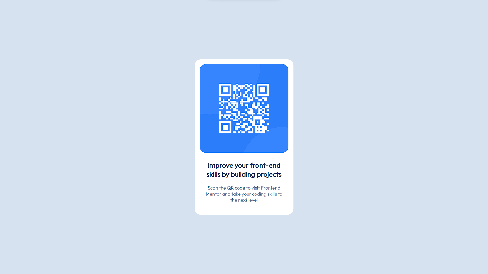

# Frontend Mentor - QR code component solution

This is a solution to the [QR code component challenge on Frontend Mentor](https://www.frontendmentor.io/challenges/qr-code-component-iux_sIO_H). Frontend Mentor challenges help you improve your coding skills by building realistic projects. 

### Screenshot

### Links

- Solution URL: [https://www.frontendmentor.io/solutions/qr-code-component-using-css-flex-3vHJytb2Lu]
- Live Site URL: [https://frontend-mentor-qr-code-component-live.vercel.app/]

## My process

### Built with

- Semantic HTML5 markup
- CSS custom properties
- Flexbox
- Media Queries

## Author
- Author - Mohit Maurya
- Frontend Mentor - [@Ken-1219](https://www.frontendmentor.io/profile/Ken-1219)

